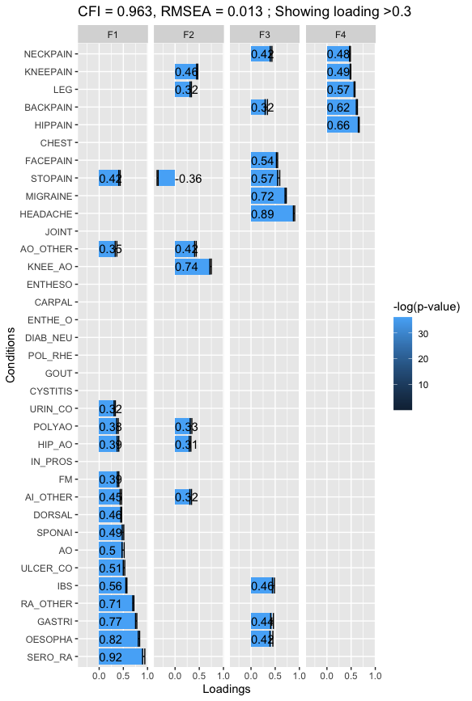
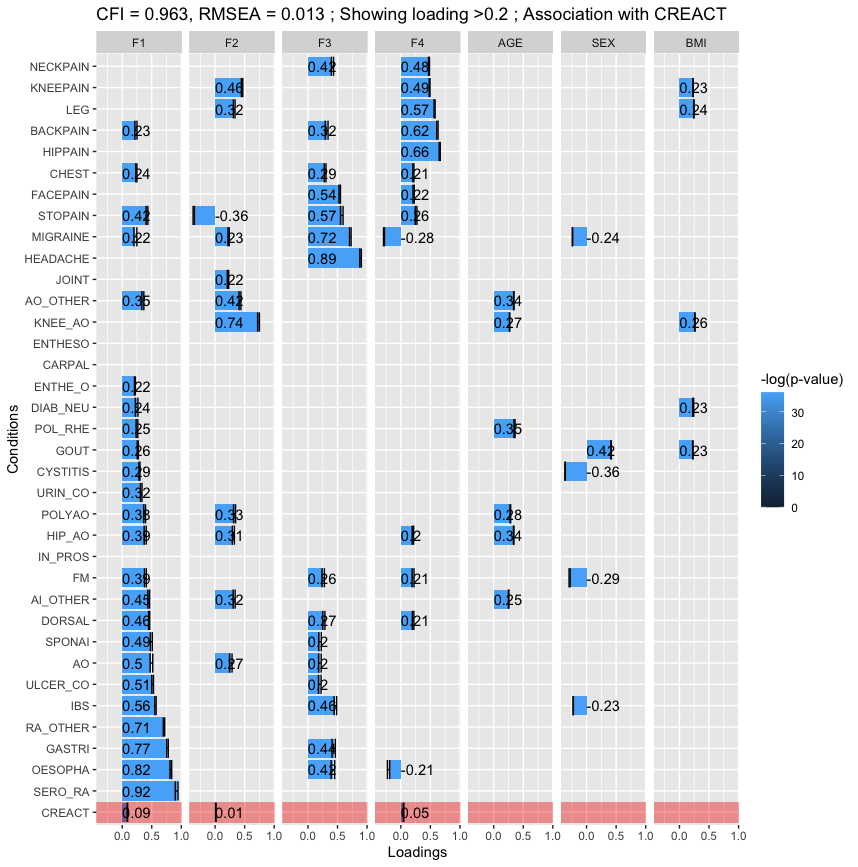

# PlotMplus
R package to plot loading, correlation matrix, scree plot, etc. from MPLUS output. 

Functions added so far

* plot_esem
* plot_cor
* plot_loading
* plot_scree

### `plot_cor`
MPLUS report contains the correlation matrix in a lower triangular format. The `plot_cor` converts it to a full square matrix and use the `corrplot` package to output a plot of correlation matrix.
It uses only the basic features of corrplot but advanced features will be added. 

### `plot_loading`
Plots the loading matrix. The loadings are extracted from MPLUS output from the parameters section. Any row with 'BY' is considered as loading. This function returns a `ggplot` and so can be customize for higher resoluation and other modifications. An example plot: (in low resolution)



### `plot_esem`

In addition to plot the loading the `plot_esem` function also include the $\beta$ of the $Y=\beta_0 + \beta X + \epsilon$ where $Y$ are the dependent variables and $X$ are the covariates. This is the situation if you want to control for some covariates before fitting the EFA model. In the given sample example, which can be accessed using `mplus_out = system.file("extdata", "sample_esem.out", package = "PlotMplus")`, we controlled the dependent variables for AGE, SEX, and BMI. Here is the example output from 

```
mplus_out = system.file("extdata", "sample_esem.out", package = "PlotMplus")
plot_esem(model_output = mplus_out, covariates = c('AGE','SEX','BMI'),indep.var = 'CREACT',sort = T)
```



The last red shaded row represent the parameter estimate of the dependent variable on the factors. In the sample example, the dependent variable was the C-reactive protein. 

### plot_scree

Use the correlation matrix from MPLUS output and make a simple `geom_point` ggplot. Some more fancy features will be added. 

### plot_factor_cor

Use the WITH rows of the parameter estimation output e.g. F2.WITH F1, F2.WITH F2 etc to get correlation matrix and use corrplot to plot it


